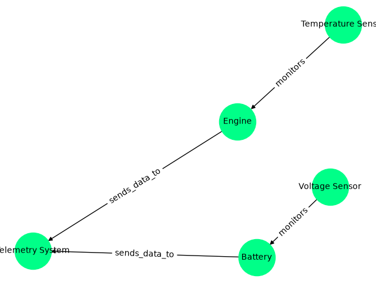

# Real-Time Telemetry Platform

Live multi-sensor data ingestion, streaming, and visualization 
built with FastAPI, WebSockets, Docker, and Python.

## Quick Start (Docker)
docker compose up --build

Open http://localhost:8000

## What it does
- Ingests high-frequency sensor data via REST API
- Streams live data to all connected clients via WebSocket
- Supports multiple simultaneous sensors (engine temp, battery voltage)
- Stores last 50 readings accessible via REST endpoint
- Includes a vehicle sensor knowledge graph built with NetworkX
- One command deployment with Docker Compose

## How it works
Sensor → POST /ingest → FastAPI → WebSocket broadcast → Live dashboard
                                ↓
                         data_store (last 50 readings)

## API
- POST /ingest — send sensor reading
- GET /data — retrieve last 50 readings  
- GET / — live streaming dashboard
- WS /ws — WebSocket connection for real-time updates

## Knowledge Graph
Models relationships between vehicle sensors and systems.
Temperature Sensor → monitors → Engine → sends_data_to → Telemetry System
Battery → monitors → Voltage Sensor → sends_data_to → Telemetry System

## Why I built this
Vehicle telemetry, industrial IoT, and robotics systems share the same 
core problem: high-frequency data that needs to be ingested, processed, 
and visualized in real time. This is my working implementation of that 
pipeline — containerized and deployable in one command.

## Stack
FastAPI · WebSockets · Docker · NetworkX · Python 3.11
